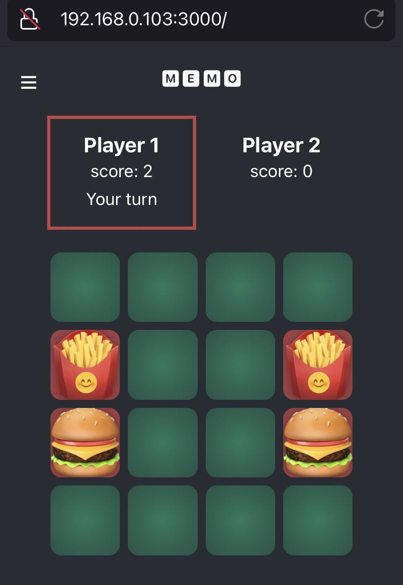

# Memo (a.k.a. Matchbox)

A classic game of memory. The goal is to match more pairs of cards then another player.

### Extra features
- unique set of card imagery in each game
- works great even on mobile devices: 

### How to run
1. Checkout or download zip.
2. Run `npm i` and `npm start`.
3. Open [http://localhost:3000](http://localhost:3000) to view it in the browser.

### Technical notes

- bootstrapped using `create-react-app`
- written in Typescript
- minimalistic (no 3rd party libraries used)
- uses the Fisher-Yates shuffling algorithm for more decent randomness than using e.g. `sort()` method.

#### Building the app

Run `npm run build`.

This builds the app for production to the `build` folder.\
It correctly bundles React in production mode and optimizes the build for the best performance.

The build is minified and the filenames include the hashes.\
Your app is ready to be deployed!
