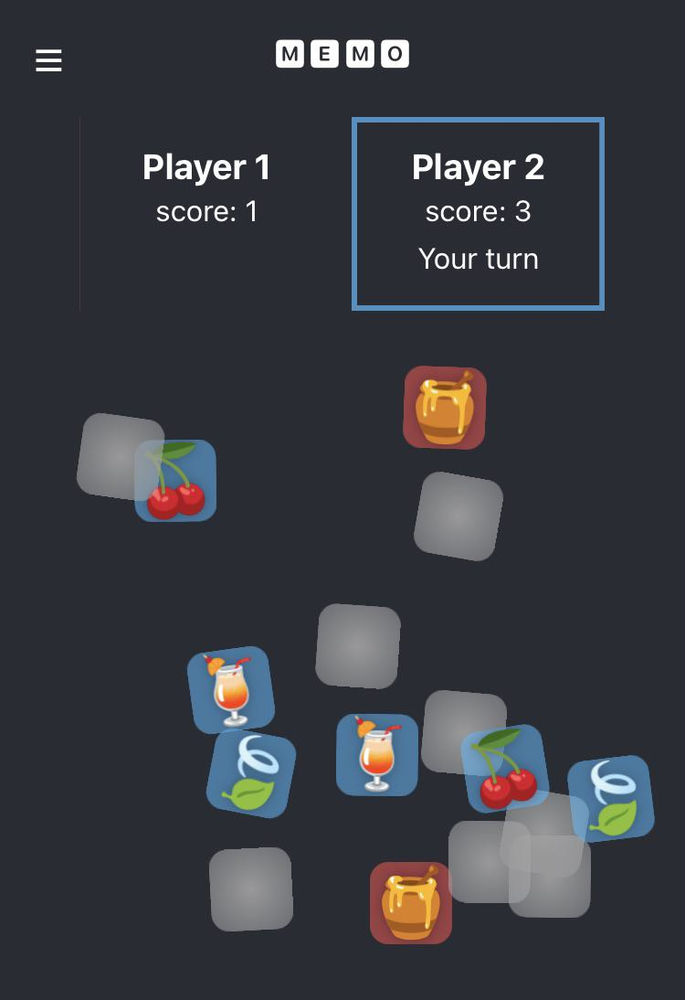

# Memo (a.k.a. Matchbox)

A classic game of memory. The goal is to match more pairs of cards then another player.

You can check it out here: https://pd-lb.github.io/memory/

### Extra features
- unique set of card imagery in each game
- works great even on mobile devices: 

### Ideas for future releases

1. Broaden the range of emoji symbols used
2. Play with no mouse - just a keyboard
3. Add a way to play over the network (not on the same machine)
4. Dark/light theme switching
5. Config file (for UI theme, emojis used, other in-app variables)
6. Add some subtle, non-distracting sound effects
7. Game stats (number of attempts, number of turns/rounds, success ratio, high score).

### How to run
1. Checkout or download zip.
2. Run `npm i` and `npm start`.
3. Open [http://localhost:3000](http://localhost:3000) to view it in the browser.

### Technical notes

- bootstrapped using `create-react-app`
- written in Typescript
- uses the Fisher-Yates shuffling algorithm for increased randomness.

#### Building the app

Run `npm run build`.

This builds the app for production to the `build` folder.\
It correctly bundles React in production mode and optimizes the build for the best performance.

The build is minified and the filenames include the hashes.\
Your app is ready to be deployed!
